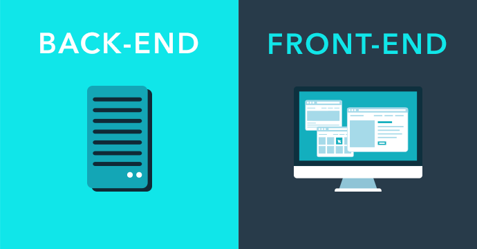
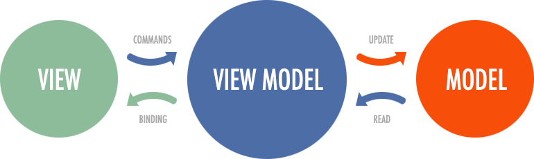
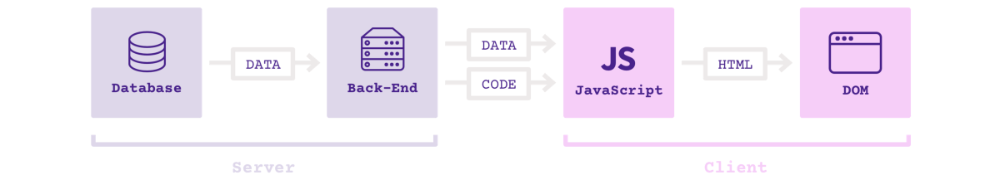

# 前端開發的歷史和趨勢

---

## 什麼是前端

- 前端：針對瀏覽器的開發，程式碼在瀏覽器運行
- 後端：針對伺服器的開發，程式碼在伺服器運行



---

## 前後端不分的時代

Internet 發展的早期，前後端開發是一體的，前端程式碼是後端程式碼的一部分。

1. 後端收到瀏覽器的請求
1. 生成靜態頁面
1. 發送到瀏覽器

---

## 後端 MVC 的開發模式

那時的網站開發，採用的是後端 MVC 模式。

- Model（模型層）：提供 / 保存資料
- Controller（控制層）：資料處理，實現業務邏輯
- View（視圖層）：展示資料，提供用戶界面

前端只是後端 MVC 的 V。

---

以 PHP 框架 Laravel 為例。


---

## 前端工程師的角色

那時的前端工程師，實際上是模板工程師，負責編寫頁面模板。

後端程式碼讀取模板，替換變數，渲染出頁面。

---

## 典型的 PHP 模板

```php
<html>
  <head><title>Car {{ $car->id }}</title></head>
  <body>
    <h1>Car {{ $car->id }}</h1>
    <ul>
      <li>Make: {{ $car->make }}</li>
      <li>Model: {{ $car->model }}</li>
      <li>Produced on: {{ $car->produced_on }}</li>
    </ul>
  </body>
</html>
```

---

## Ajax

Ajax 技術誕生，改變了一切。

- 2004年：Gmail
- 2005年：Google Maps

前端不再是後端的模板，可以獨立得到各種資料。

---

## Web 2.0

Ajax 技術促成了 Web 2.0 的誕生。


- Web 1.0：靜態網頁，純內容展示
- Web 2.0：動態網頁，富有互動性，前端資料處理

從那時起，前端變得複雜了，對前端工程師的要求越來越高。

---

## 前端 MVC 框架

前端通過 Ajax 得到資料，因此也有了處理資料的需求。

前端程式碼變得也需要保存資料、處理資料、生成視圖，這導致了前端 MVC 框架的誕生。

- 2010年，Backbone.js


---

## Backbone.js

Backbone 將前端代碼分成兩個基本部分。

- Model：管理資料
- View：資料的展現


---

## 前端 Controller

Backbone 只有 M 和 V，沒有 C。因為，前端 Controller 與後端不同。

- 不需要，也不應該處理業務邏輯
- 只需要處理 UI 邏輯，響應用戶的一舉一動

所以，前端 Controller 相對比較簡單。 Backbone 沒有 C，只用事件來處理 UI 邏輯。

```javascript
  var AppView = Backbone.View.extend({
    // ...
    events: {
      "keypress #new-todo": "createOnEnter",
      "click #clear-completed": "clearCompleted",
      "click #toggle-all": "toggleAllComplete"
    },
  });
```

---

## Router

前端還有一種天然的方法，可以切換視圖，那就是 URL。

通過 URL 切換視圖，這就是 Router（路由）的作用。以 Backbone 為例。


---

```javascript
App.Router = Backbone.Router.extend({
  routes: {
    '': 'index',
    'show': 'show'
    },
  index: function () {
    $(document.body).append("調用了 Index 路由");
  },
  show: function () {
    $(document.body).append("調用了 Show 路由");
  },
});
```
---

## 範例：Backbone Router

打開`demos/backbone-demo/index.html`，按照[《操作說明》](../demos/README.md#backbone)，查看範例。


---

## MVVM 模式

另一些框架提出 MVVM 模式，用 View Model 代替 Controller。

- Model
- View
- View-Model：簡化的 Controller，唯一作用就是為 View 提供處理好的資料，不含其他邏輯。

本質：view 綁定 view-model，視圖與資料模型強耦合。資料的變化即時反映在 view 上，不需要手動處理。



---

## SPA

前端可以做到：

> - 讀寫資料
> - 切換視圖
> - 用戶互動

這意味著，網頁其實是一個應用程式。

> SPA = Single-page application

2010年後，前端工程師從開發頁面，變成了開發「前端應用」（跑在瀏覽器裡面的應用程式）。

---

傳統的架構


單頁應用的架構



多了一個前端 MVC 層

---

## Angular

Google 公司推出的 Angular 是最流行的 MVVM 前端框架。

它的風格屬於 HTML 語言的增強，核心概念是雙向綁定（two-way binding）。


---

## 範例：Angular 的雙向綁定

瀏覽器打開 `demos/angular-demo/index.html`，可以看到一個輸入框。


---

```javascript
<div ng-app="">
  <p>
    姓名 :
    <input
      type="text"
      ng-model="name"
      placeholder="在這裡輸入您的大名"
    >
  </p>
  <h1>你好，{{name}}</h1>
</div>
```

---

## Vue

Vue.js 是現在很熱門的一種前端 MVVM 框架。

它的基本思想與 Angular 類似，但是用法更簡單，而且引入了回應式程式設計（Reactive programming）的概念。


---

## 範例：Vue 的雙向綁定

Vue 的模板與資料，是雙向綁定的。

打開 `demos/vue-demo/index1.html`，按照[《操作說明》](../demos/README.md#vue)，查看範例。


---

HTML 代碼

```html
<div id="journal">
  <input type="text" v-model="message">
  <div>{{message}}</div>
</div>
```

JS 代碼

```javascript
var journal = new Vue({
  el: '#journal',
  data: {
    message: 'Your first entry'
  }
});
```

---

## 前後端分離

- Ajax -> 前端應用興起
- 智慧型手機 -> 多終端支持

這兩個原因，導致前端開發方式發生根本的變化。

前端不再是後端 MVC 中的 V，而是單獨的一層。

---

## REST API

前後端分離以後，它們之間通過 API 通訊。

後端暴露出 API，前端消費後端提供的資料。

後端 API 一般是 REST 形式，前後端的通訊協議一般是 HTTP。

---

## Node

2009年，Node 專案誕生，它是伺服器上的 JavaScript 運行環境。

Node = JavaScript + 作業系統 API


---

## Node 的意義

- JavaScript 成為伺服器腳本語言，與 Python 和 Ruby 一樣
- JavaScript 成為唯一的瀏覽器和伺服器都支持的語言
- 前端工程師可以編寫後端程式了

---

## 前端開發模式的根本改變

- Node 環境下開發
- 大量使用伺服器端工具
- 引入持續整合等軟體工程的標準流程
- 開發完成後，編譯成瀏覽器可以運行的腳本，放上 CDN

---

## 全端工程師

前端工程師正在轉變為全端工程師

- 一個人負責開發前端和後端
- 從資料庫到 UI 的所有開發

---

## 全端技能

怎樣才能稱為全端工程師？

- 傳統前端技能：HTML、JavaScript、CSS
- 一門後端語言
- 行動端開發：iOS / Android / HTML5
- 其他技能：資料庫、HTTP 等等

---

## 軟體行業的發展動力

歷史演變：前後端不分 -> 前後端分離 -> 全端工程師

動力：更加產業化、大規模地生產軟體

- 效率更高
- 成本更低

通用性好、能夠快速產出的技術最終會贏，單個程式設計師的生產力要求越來越高。

---

## Mobile Web App 就是一個最好的例子

Mobile Web App 的優勢

- 開發速度快：Native App 需要重新編譯才能看到結果，Mobile Web App 是即時輸出
- 開發成本低：Native App 需要兩個開發團隊，Mobile Web App 只要一個
- 快速發布：Android Native App 新版本需要 24 小時，iOS 需要 3 ～ 4 天，Mobile Web App 可以隨時更新

---

## 未來軟體的特點

- 連網
- 高併發
- 分散式
- 跨平台

現在基於 Web 的前端技術，將演變為未來所有軟體的通用的 GUI 解決方案。

---

## 未來只有兩種軟體工程師

- 端工程師
  - 手機端
  - PC 端
  - TV 端
  - VR 端
  - ……
- 雲工程師