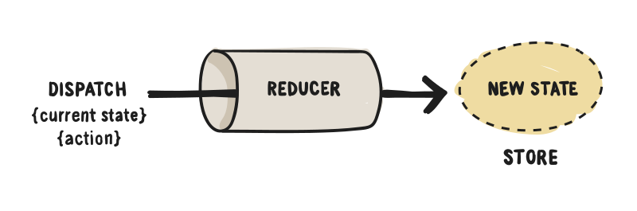
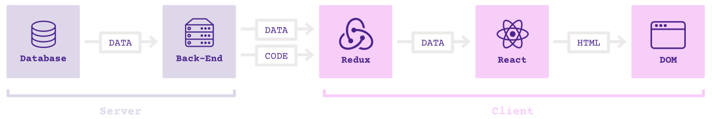

# React 技術棧

---

React 是目前最熱門的前端框架。

- Facebook 公司 2013 年推出
- 現在最好的社區支持和生態圈
- 大量的第三方工具


---

## React 的優點

- 元件模式：程式碼複用和團隊分工
- 虛擬 DOM：性能優勢
- 行動端支持：跨平台

---

## React 的缺點

- 學習曲線較陡峭
- 全新的一套概念，與其他所有框架截然不同
- 只有採用它的整個技術棧，才能發揮最大威力

總結：React 非常先進和強大，但是學習和實現成本都不低

---

## JSX 語法

React 使用 JSX 語法，JavaScript 程式碼中可以寫 HTML 程式碼。

```javascript
let myTitle = <h1>Hello, world!</h1>;
```

---

## JSX 語法解釋

（1）JSX 語法的最外層，只能有一個節點。

```javascript
// 錯誤
let myTitle = <p>Hello</p><p>World</p>;
```

（2）JSX 語法中可以插入 JavaScript 程式碼，使用大括號。

```javascript
let myTitle = <p>{'Hello ' + 'World'}</p>
```

---

## Babel 轉碼器

JavaScript 引擎（包括瀏覽器和 Node）都不認識 JSX，需要首先使用 Babel 轉碼，然後才能運行。

```html
<script src="react.js"></script>
<script src="react-dom.js"></script>
<script src="babel.min.js"></script>
<script type="text/babel">
  // ** Our code goes here! **
</script>
```

React 需要載入兩個函式庫：React 和 React-DOM，前者是 React 的核心函式庫，後者是 React 的 DOM 適配函式庫。

Babel 用來在瀏覽器轉換 JSX 語法，如果伺服器已經轉好了，瀏覽器就不需要載入這個庫。

---

## 課堂練習：JSX 語法

瀏覽器打開 `demos/jsx-demo/index.html`，按照[《操作說明》](../demos/README.md#jsx)，完成練習。

```javascript
ReactDOM.render(
  <span>Hello World!</span>,
  document.getElementById('example')
);
```

---

## 範例：React 元件

React 允許用戶定義自己的元件，插入網頁。

瀏覽器打開 `demos/react-component-demo/index1.html`，按照[《操作說明》](../demos/README.md#react-元件語法)，仔細查看原始碼。

```javascript
class MyTitle extends React.Component {
  render() {
    return <h1>Hello World</h1>;
  }
};

ReactDOM.render(
  <MyTitle/>,
  document.getElementById('example')
);
```

---

## 課堂練習：元件的參數

元件可以從外部傳入參數，內部使用 `this.props` 獲取參數。

打開`demos/react-component-demo/index2.html`，按照[《操作說明》](../demos/README.md#react-元件的參數)，完成練習。

```javascript
class MyTitle extends React.Component {
  render() {
    return <h1
      style={{color: this.props.color}}
    >Hello World</h1>;
  }
};

<MyTitle color="red" />,
```

---

## 範例：元件的狀態

元件往往會有內部狀態，使用 `this.state` 表示。

瀏覽器打開 `demos/react-component-demo/index3.html`，按照[《操作說明》](../demos/README.md#react-元件的狀態)，仔細查看原始碼。


---

## 課堂練習：React 元件實戰

瀏覽器打開 `demos/react-component-demo/index4.html`，按照[《操作說明》](../demos/README.md#react-元件實戰)，完成練習。

---

## 元件的生命週期

React 為元件的不同生命階段，提供了近十個鉤子方法。

- `componentWillMount()`：元件載入前調用
- `componentDidMount()`：元件載入後調用
- `componentWillUpdate()`: 元件更新前調用
- `componentDidUpdate()`: 元件更新後調用
- `componentWillUnmount()`：元件卸載前調用
- `componentWillReceiveProps()`：元件接受新的參數時調用

我們可以利用這些鉤子（hooks），自動完成一些操作。

---

## 課堂練習：元件的生命週期

元件可以通過 Ajax 請求，從伺服器獲取資料。 Ajax 請求一般在 `componentDidMount` 方法裡面發出。

```javascript
componentDidMount() {
  const url = '...';
  $.getJSON(url)
    .done()
    .fail();
}
```

打開 `demos/react-lifecycle-demo/index.html`，按照[《操作說明》](../demos/README.md#react-元件的生命週期)，完成練習。

---

## React 元件庫

React 的一大優勢，就是網路上有很多已經寫好的元件函示庫，可以使用。

React-Bootstrap：https://react-bootstrap.github.io/


---

## 範例：ReCharts

ReCharts 是一個 React 圖表元件函示庫。 http://recharts.org/

瀏覽器打開 `demos/recharts-demo/index.html`，按照[《操作說明》](../demos/README.md#recharts)，仔細查看原始碼，體會 JSX 語法對表達複雜元件的優勢。

```html
<LineChart width={1000} height={400} data={data}>
  <XAxis dataKey="name"/>
  <YAxis/>
  <CartesianGrid stroke="#eee" strokeDasharray="5 5"/>
  <Line type="monotone" dataKey="uv" stroke="#8884d8" />
  <Line type="monotone" dataKey="pv" stroke="#82ca9d" />
</LineChart>
```

---

## React 的核心思想

View 是 State 的輸出。

```javascript
view = f(state)
```

上式中，`f` 表示函數關係。只要 State 發生變化，View 也要隨之變化。

---

React 的本質是將圖形界面（GUI）函式化。

```javascript
const person = {
  name: "michel",
  age: 31
}

const App = ({ person }) => <h1>{ person.name }</h1>

ReactDOM.render(<App person={person} />, document.body)
```

---

## React 沒有解決的問題

React 本身只是一個 DOM 的抽象層，使用元件構建虛擬 DOM。

如果開發大型應用，還需要解決兩個問題。

- 架構：大型應用程式應該如何組織程式碼？
- 通訊：元件之間如何通訊？

---

## 架構問題

React 只是視圖層的解決方案，可以用於任何一種架構。

- MVC
- MVVM
- Observer
- Reactive
- ...

到底哪一種架構最合適 React ？

---

## 通訊問題

元件會發生三種通訊。

- 向子元件發訊息
- 向父元件發訊息
- 向其他元件發訊息

React 只提供了一種通訊手段：傳遞參數。對於大型應用，很不方便。

---

## 狀態的同步

通訊的本質是狀態​​的同步。

React 同步狀態的基本方法：找到通訊雙方最近的共同父元件，通過它的 `state`，使得子元件的狀態保持同步。

---

## Flux 架構

Facebook 提出 Flux 架構的概念，被認為是 React 應用的標準架構。


最大特點：資料單向流動。與 MVVM 的資料雙向綁定，形成鮮明對比。

---

## Flux 的核心思想

- 不同元件的 `state`，存放在一個外部的、公共的 Store 上面。
- 元件訂閱 Store 的不同部分。
- 元件發送（dispatch）動作（action），引發 Store 的更新。

Flux 只是一個概念，有 30 多種實現。

---

## 目前最流行的兩個 React 架構

React 架構的最重要作用：管理 Store 與 View 之間的關係。

- MobX：回應式（Reactive）管理，state 是可變對象，適合中小型專案
- Redux：函數式（Functional）管理，state 是不可變對象，適合大型專案

---

## MobX 架構

MobX 的核心是觀察者模式。

- Store 是被觀察者（observable）
- 元件是觀察者（observer）

一旦 `Store` 有變化，會立刻被元件觀察到，從而引發重新渲染。

---

## MobX 的最簡單例子

```javascript
const {observable} = mobx;
const {observer} = mobxReact;

const person = observable({name: "張三", age: 31});

const App = observer(
  ({ person }) => <h1>{ person.name }</h1>
);

ReactDOM.render(<App person={person} />, document.body);
person.name = "李四";
```

程式碼：`demos/mobx-demo/browser-demo` 目錄

---

## 範例：MobX

進入 `demos/mobx-demo` 目錄，按照[《操作說明》](../demos/README.md#mobx)，理解 MobX 框架。

---

UI 層是觀察者，Store 是被觀察者。

Store 所有的屬性，分成兩大類：直接被觀察的屬性和自動計算出來的屬性。

```javascript
class Store {
  @observable name = 'Bartek';
  @computed get decorated() {
    return `${this.name} is awesome!`;
  }
}
```

UI 會觀察到 Store 的變化，自動重新渲染。

---

## Redux 架構

Redux 的核心概念

- 所有的狀態存放在 `Store`。元件每次重新渲染，都必須由狀態變化引起。
- 用戶在 UI 上發出 `action`。
- `reducer` 函式接收 `action`，然後根據當前的 `state`，計算出新的 `state`。



---

## Redux 應用的架構



Redux 層保存所有狀態，React 元件拿到狀態以後，渲染出 HTML 程式碼。

---

## 範例：Redux

進入 `demos/redux-demo` 目錄，按照[《操作說明》](../demos/README.md#redux)，理解 Redux 框架。

---

- Redux 將元件分成展示型元件（Presentational Components）和容器型元件（Container Components）兩類。
- 展示型元件是純元件，不包含 state 和生命週期方法，不涉及元件的行為，只涉及元件的外觀。

```javascript
<div className="index">
  <p>{this.props.text}</p>
  <input
    defaultValue={this.props.name}
    onChange={this.props.onChange}
  />
</div>
```

---

容器型元件正好相反。

- 不涉及元件的外觀，只涉及元件的行為。
- 負責訂閱 Store，將 Store 的資料處理以後，再通過參數傳給展示型元件。
- 用戶給出配置以後，由 Redux 生成。

```javascript、
// MyComponent 是純的展示型元件
const App = connect(
  mapStateToProps,
  mapDispatchToProps
)(MyComponent);
```

- `mapStateToProps`：定義展示型元件參數與 State 之間的映射
- `mapDispatchToProps`：定義展示型元件與 Action 之間的映射

---

## 拆分展示型元件和容器型元件的好處

- 展示型元件與後台資料無關，可以由設計師負責
- 容器型元件只負責資料和行為，一旦 Store 的資料結構變化，只要調整容器型元件即可
- 表現層和功能層脫鉤，有利於程式碼重用，也有利於看清應用的資料結構和業務邏輯

---

## Reducer 函式

`reducer` 是一個純函式，用來接收 `action`，算出新的 `state`。

```javascript
function reducer(state = {
  text: '你好，訪問者',
  name: '訪問者'
}, action) {
  switch (action.type) {
    case 'change':
      return {
        name: action.payload,
        text: '你好，' + action.payload
      };
  }
}
```

---

- `Store` 由 Redux 提供的 `createStore` 方法生成，該方法接受 `reducer` 作為參數。
- 為了把 `Store` 傳入元件，必須使用 Redux 提供的 `Provider` 元件在應用的最外面，包裹一層。

```javascript
const store = createStore(reducer);

ReactDOM.render(
  <Provider store={store}>
    <App />
  </Provider>,
  document.body.appendChild(document.createElement('div'))
);
```
